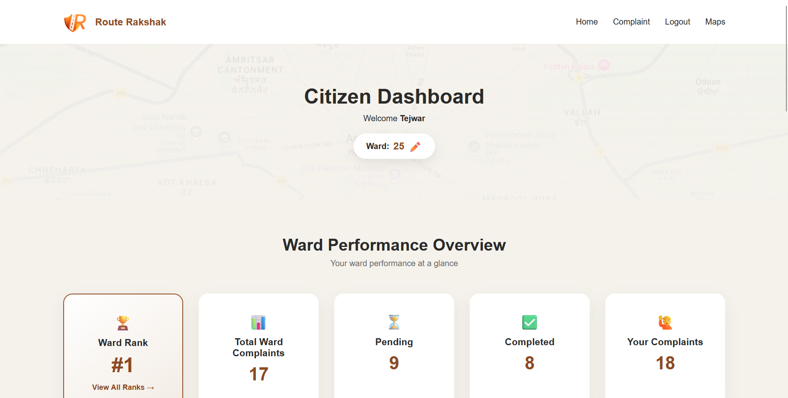
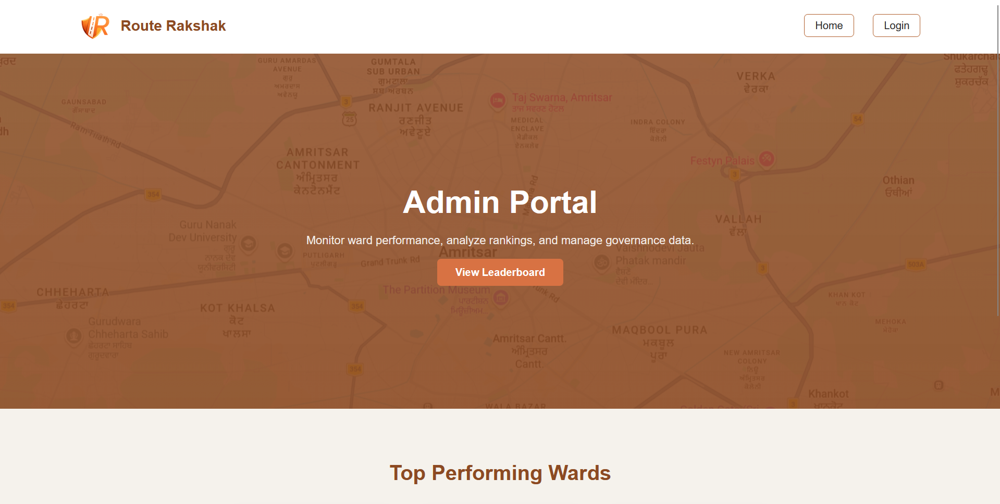
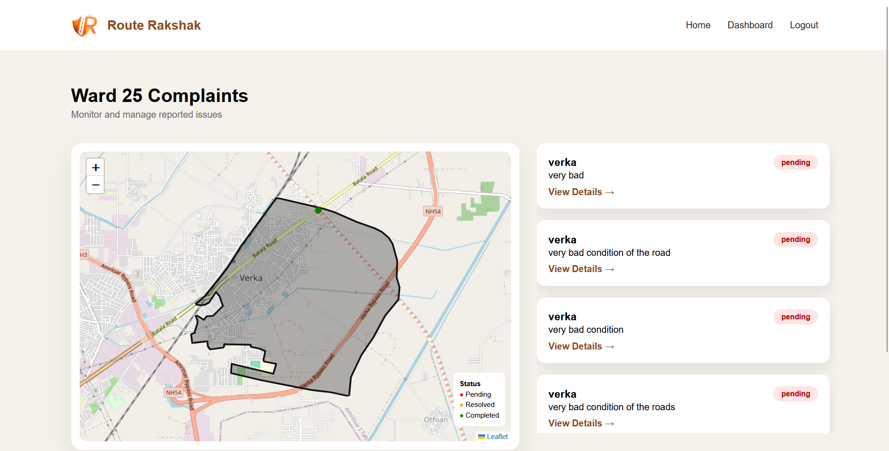
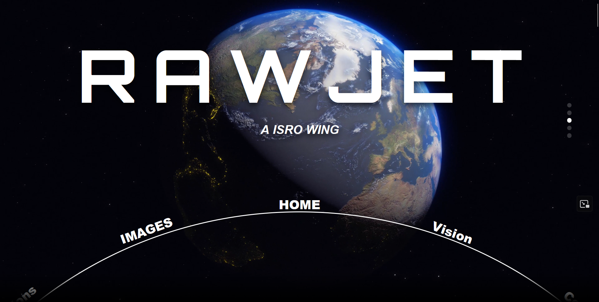
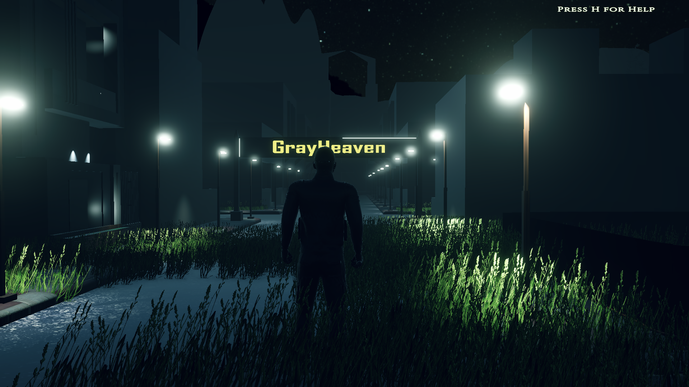
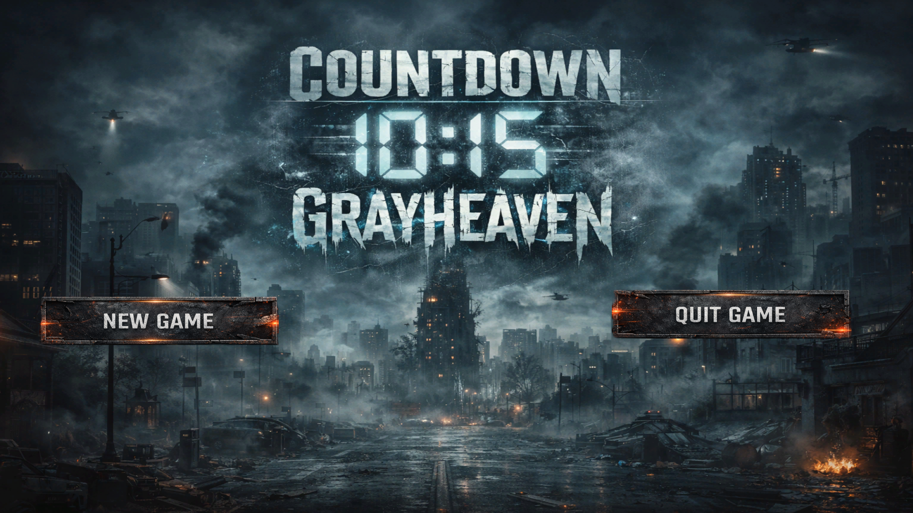

<h1 align="center">Hi 👋, I'm Tejwardeep Singh</h1>
<h3 align="center">Full Stack Developer • MERN Stack • Building Scalable Web Applications</h3>

  

  

---

## 🧠 About Me

* 🎓 B.Tech Computer Science (2024–2028)
* 💻 Full Stack Developer (MERN Stack)
* 🚀 Building real-world scalable applications
* ⚙️ Learning backend systems & system design
* 🎯 Goal: Crack top product-based companies

---

## ⚙️ Tech Stack

  

---

## 🏆 Featured Projects

---
### 1. RouteRakshak — Civic Intelligence Platform

  
  
  

> 🧠 A real-world civic-tech platform designed to bridge the gap between citizens and local governance through structured issue reporting and data-driven transparency.

---

### ⚡ Key Highlights

* 📌 Built a **complaint lifecycle system** (submission → tracking → resolution)
* 📊 Designed **ward-level performance analytics** based on issue density & resolution rate
* 🧑‍💼 Developed a **centralized admin dashboard** for monitoring and decision-making
* 🔄 Implemented **structured REST APIs** for scalable data handling
* 📍 Enabled **location-based complaint categorization**

---

### 🏗️ Engineering Focus

* ⚙️ Backend architecture designed for **scalability and modularity**
* 🧠 Data modeling for **efficient query performance (MongoDB)**
* 🔐 Session-based authentication for controlled access
* 📡 Designed keeping **real-world deployment constraints** in mind

---

### 🌍 Impact

* 🏙️ Improves transparency in local governance systems
* 📈 Enables data-driven decision making for authorities
* 👥 Empowers citizens with structured complaint tracking

---

### 🛠️ Tech Stack

`Node.js` • `Express.js` • `MongoDB` • `EJS` • `REST APIs`

---

### 🔗 Live Platforms

* 🧑‍💼 Admin Portal → https://routerakshakadmin.onrender.com/
* 👤 Citizen Portal → https://routerakshak.onrender.com/

### Team

Tejwardeep Singh (Team Lead)
Eklavya
Snehdeep Kaur
Aemryne Sandhu
---

### 2. E-Election Platform — Secure Digital Voting System

  

> 🔐 A full-stack election system designed to simulate real-world voting workflows with a focus on **security, data integrity, and controlled access**.

---

### ⚡ Key Highlights

* 🧑‍💼 Built a **role-based system** (Admin → Candidate Management, Voter → Voting Interface)
* 🔐 Implemented **controlled authentication flow** to prevent unauthorized voting
* 🗳️ Designed a **one-vote-per-user mechanism** ensuring fairness
* 📊 Automated **real-time vote counting and result generation**
* ☁️ Integrated **Cloudinary** for secure media storage (candidate & party assets)

---

### 🏗️ Engineering Focus

* ⚙️ Designed backend workflows to ensure **data consistency during voting**
* 🧠 Structured MongoDB schema for **efficient vote aggregation**
* 🔄 REST APIs optimized for **reliability and scalability**
* 🚫 Prevented duplicate voting using **session & validation logic**

---

### 🌍 Impact

* 🧪 Simulates real-world election systems for learning & experimentation
* 🔐 Demonstrates secure handling of sensitive workflows
* 📈 Showcases backend logic for **high-integrity systems**

---

### 🛠️ Tech Stack

`React.js` • `Node.js` • `Express.js` • `MongoDB` • `Cloudinary`

---

### 🔗 Live Platforms

* 🧑‍💼 Admin Portal → https://adminrawjet.onrender.com/
* 👤 Voter Portal → https://voterrawjet.onrender.com/

---

### 3. ISRO RawJet — Interactive Space Experience Platform

  

> 🚀 A high-performance, animation-driven web experience inspired by ISRO, designed to deliver **immersive storytelling through advanced frontend engineering**.

---

### ⚡ Key Highlights

* 🎯 Built a **multi-page interactive platform** showcasing space missions, updates, and vision
* 🎨 Implemented **GSAP-powered animations** for smooth, timeline-based transitions
* 🛰️ Designed **mission timelines and interactive sections** for engaging exploration
* 📱 Developed a fully **responsive UI optimized across devices**
* ✨ Focused on **user experience with cinematic visual flow**

---

### 🏗️ Engineering Focus

* ⚡ Optimized rendering for **smooth animations without performance drops**
* 🧠 Structured frontend for **maintainability and scalability**
* 🎬 Managed complex animation sequences using **GSAP timelines**
* 🚀 Ensured fast load times with **efficient asset handling**

---

### 🌍 Impact

* 🌌 Transforms static information into an **interactive learning experience**
* 🎯 Demonstrates strong **frontend engineering & UI/UX skills**
* ⚡ Showcases ability to build **production-level interactive websites**

---

### 🛠️ Tech Stack

`HTML` • `CSS` • `JavaScript` • `GSAP`

---

### 🌐 Live Demo

🔗 https://isroraw.netlify.app/

---

### 4. Countdown: Grayheaven — Narrative Horror Experience

  
  

> 🌑 A story-driven horror game designed to deliver a **psychological and immersive experience**, where gameplay, environment, and narrative evolve together to reveal hidden truths.

---

### ⚡ Key Highlights

* 🧩 Designed **puzzle-based progression system** integrated with storyline
* 🎭 Developed a **narrative-driven gameplay flow** with suspenseful pacing
* 🌌 Built immersive **3D environments with atmospheric lighting**
* 🎯 Focused on **player engagement through exploration and interaction**
* 🔊 Enhanced experience using **environmental storytelling techniques**

---

### 🏗️ Engineering Focus

* ⚙️ Implemented gameplay logic using **C# scripting in Unity**
* 🧠 Designed modular systems for **scene transitions and interactions**
* 🎮 Managed game states for **smooth progression and continuity**
* 🎬 Balanced performance and visuals for **consistent gameplay experience**

---

### 🌍 Impact

* 🎮 Demonstrates ability to build **interactive systems beyond web apps**
* 🧠 Showcases **creative problem-solving and experience design**
* 🚀 Highlights versatility across **full stack + game development**

---

### 🛠️ Tech Stack

`Unity` • `C#` • `3D Assets` • `Game Design Principles`

---

### 🎮 Play / Download

🔗 https://rawjet.itch.io/countdown-grayheaven

---

### Developers

Tejwardeep Singh - Developer
Snehdeep Kaur - Story Writer
--- 

## 🌐 Connect With Me

* 💼 LinkedIn → https://linkedin.com/in/tejwardeep-singh
* 🌐 Portfolio → https://rawjet.netlify.app
* 💻 GitHub → https://github.com/Tejwardeep-Singh

---

⭐ <b>Focused on building impactful products & growing as a developer.</b>

