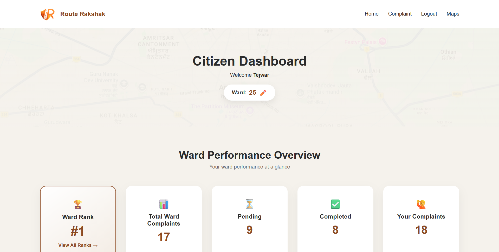
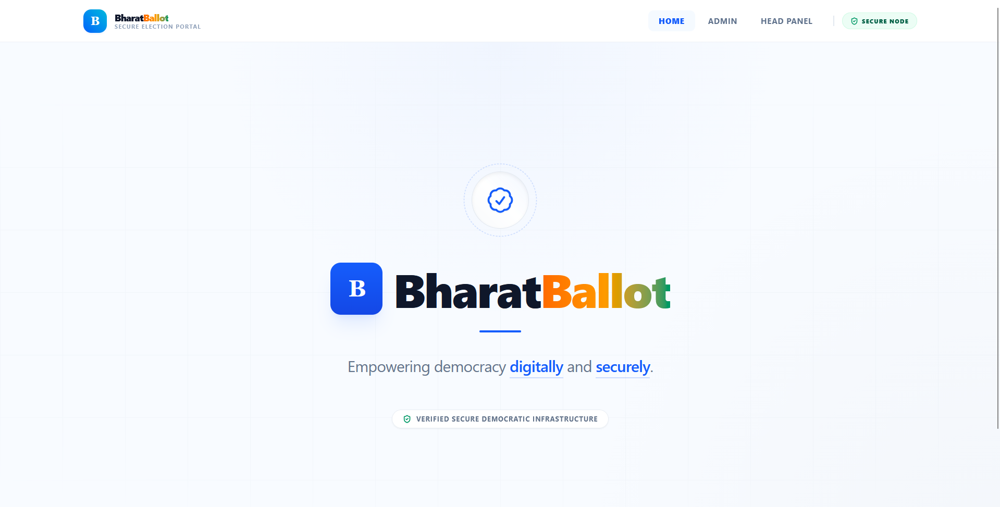
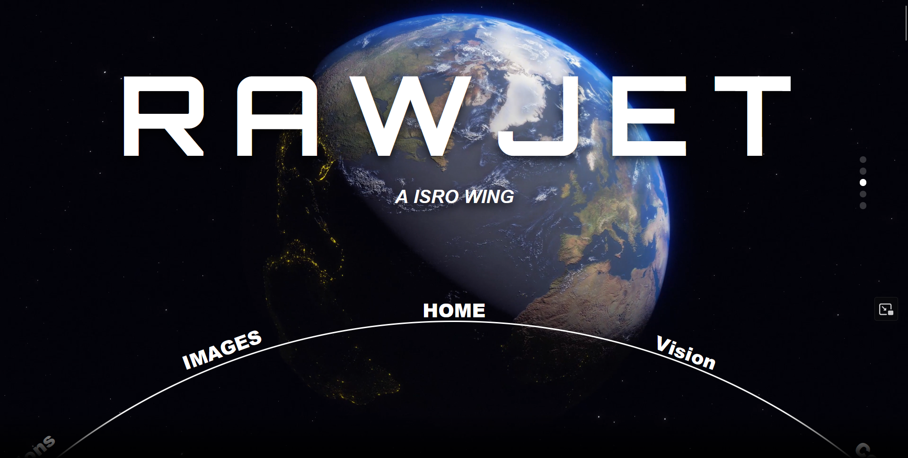
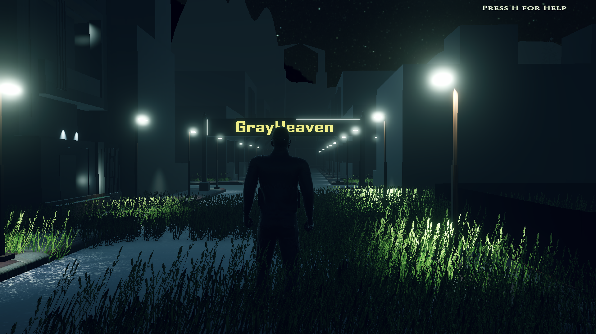

  

  <b>Full Stack Engineer • MERN Specialist • System Architecture Enthusiast</b> 
  <i>Building high-integrity systems and immersive digital experiences.</i>

  
  
  

---

### ⚡ Technical Arsenal

<table width="100%">
  <tr>
    <td width="50%" valign="top">
      <h4>💻 Development</h4>
      
    </td>
    <td width="50%" valign="top">
      <h4>🛠️ Tools & Environments</h4>
      
    </td>
  </tr>
</table>

---

### 🚀 Featured Engineering Projects

<table width="100%">
  <!-- Row 1 -->
  <tr>
    <td width="50%" valign="top">
      <h3>🛡️ RouteRakshak</h3>
      
<i>Civic Intelligence Platform</i>

      
        
      <b>Focus:</b> Scalable backend & lifecycle management. 
      <b>Stack:</b> <code>Node.js</code> <code>Express</code> <code>MongoDB</code> <code>EJS</code>
        
      <a href="https://routerakshak.onrender.com/">🔗 Live Demo</a> • <a href="https://github.com/Tejwardeep-Singh/RouteRakshak">💻 Codebase</a>
    </td>
    <td width="50%" valign="top">
      <h3>🗳️ E-Election RAWJET</h3>
      
<i>High-Integrity Voting System</i>

      
        
      <b>Focus:</b> Security & Real-time data consistency. 
      <b>Stack:</b> <code>React.js</code> <code>Node.js</code> <code>MongoDB</code> <code>Cloudinary</code>
        
      <a href="https://voterrawjet.onrender.com/">🔗 Live Demo</a> • <a href="https://github.com/Tejwardeep-Singh/E-ELECTION-RAWJET">💻 Codebase</a>
    </td>
  </tr>
  
  <!-- Row 2 -->
  <tr>
    <td width="50%" valign="top">
      <h3>🚀 ISRO RawJet</h3>
      
<i>Interactive Exploration Engine</i>

      
        
      <b>Focus:</b> Advanced UI/UX & GSAP animations. 
      <b>Stack:</b> <code>JavaScript</code> <code>GSAP</code> <code>Performance Optimization</code>
        
      <a href="https://isroraw.netlify.app/">🔗 Live Demo</a> • <a href="https://github.com/Tejwardeep-Singh/ISRO">💻 Codebase</a>
    </td>
    <td width="50%" valign="top">
      <h3>🌑 Countdown: Grayheaven</h3>
      
<i>Narrative Horror Experience</i>

      
        
      <b>Focus:</b> Game logic & 3D Atmospheric Storytelling. 
      <b>Stack:</b> <code>Unity</code> <code>C#</code> <code>Experience Design</code>
        
      <a href="https://rawjet.itch.io/countdown-grayheaven">🔗 Play Game</a> • <a href="https://github.com/Tejwardeep-Singh/countdown-grayheaven">💻 Codebase</a>
    </td>
  </tr>
</table>

---

<!-- ### 📈 Activity & Insights

  
  

 -->

  

  

